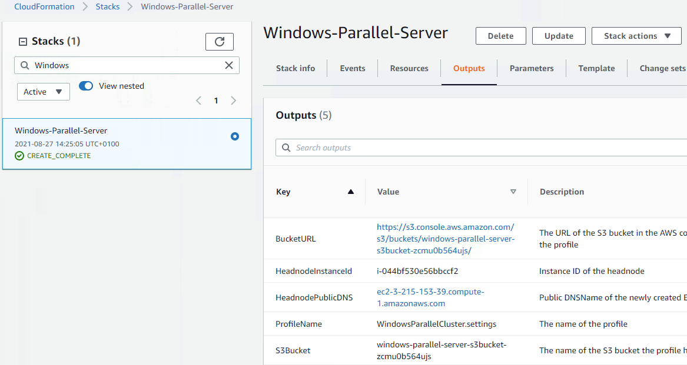
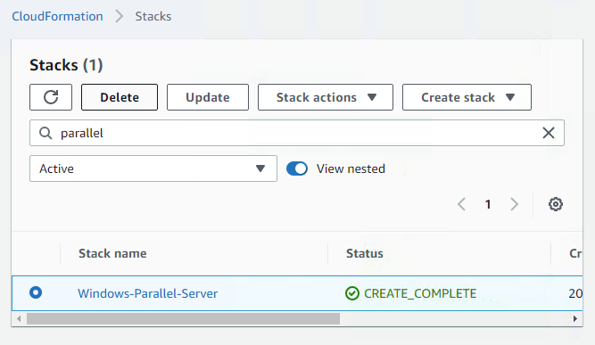

# MATLAB Parallel Server  on Amazon Web Services (Windows VM)

## Step 1. Deploy the Template

Click the **Launch Stack** button for your desired region below to deploy the cloud resources on Amazon&reg; Web Services (AWS&reg;). This opens the AWS console in your web browser.

| Region | Launch Link |
| --------------- | ----------- |
| **us-east-1** | [](https://us-east-1.console.aws.amazon.com/cloudformation/home?region=us-east-1#/stacks/create/review?templateURL=https://matlab-parallel-server-aws-win-refarch.s3.amazonaws.com/R2025b/parallel-server-template.json) |
| **us-west-2** | [](https://us-west-2.console.aws.amazon.com/cloudformation/home?region=us-west-2#/stacks/create/review?templateURL=https://matlab-parallel-server-aws-win-refarch.s3.amazonaws.com/R2025b/parallel-server-template.json) |
| **eu-west-1** | [](https://eu-west-1.console.aws.amazon.com/cloudformation/home?region=eu-west-1#/stacks/create/review?templateURL=https://matlab-parallel-server-aws-win-refarch.s3.amazonaws.com/R2025b/parallel-server-template.json) |
| **ap-northeast-1** | [](https://ap-northeast-1.console.aws.amazon.com/cloudformation/home?region=ap-northeast-1#/stacks/create/review?templateURL=https://matlab-parallel-server-aws-win-refarch.s3.amazonaws.com/R2025b/parallel-server-template.json) |


## Step 2. Configure the Cloud Resources
Clicking the **Launch Stack** button above opens the “Quick create stack” page in your browser. You can configure the parameters on this page. It is easier to complete the steps if you position these instructions and the AWS console window side by side.

1. Specify a stack name in the AWS CloudFormation console. The name must be unique within your AWS account in the region you want to deploy the stack.

2. Specify and check the defaults for these resource parameters:

| Parameter label | Description |
| --------------- | ----------- |
| **VPC to deploy this stack to** | ID of an existing VPC in which to deploy this stack |
| **Subnets for the head node and worker nodes** | List of existing public subnets IDs for the head node and workers |
| **CIDR IP address range of client** | Comma-separated list of IP address ranges that will be allowed to connect to the cluster. Each IP CIDR should be formatted as \<ip_address>/\<mask>. The mask determines the number of IP addresses to include. A mask of 32 is a single IP address. Example of allowed values: 10.0.0.1/32 or 10.0.0.0/16,192.34.56.78/32. This calculator can be used to build a specific range: https://www.ipaddressguide.com/cidr. You may need to contact your IT administrator to determine which address is appropriate. |
| **RDP Key Pair** | Name of an existing EC2 KeyPair to allow RDP access to all the instances. See https://docs.aws.amazon.com/AWSEC2/latest/UserGuide/ec2-key-pairs.html for details on creating these. |
| **Cluster name** | Name to use for this cluster. This name is shown in MATLAB as the cluster profile name. |
| **Instance type for the head node** | AWS instance type to use for the head node, which runs the job manager. No workers are started on this node, so this can be a smaller instance type than the worker nodes. By default, the heap memory for the job manager is set between 1024 MiB and a maximum of half of the instance memory, depending on the total number of MATLAB workers. See https://aws.amazon.com/ec2/instance-types for a list of instance types. Must be available in the Availability Zone of the first subnet in the configured list |
| **Custom AMI ID (Optional)** | ID of a custom Amazon Machine Image (AMI) in the target region (optional). Ensure that the custom machine image is compatible with the provided CloudFormation template. The ID should start with 'ami-'. |
| **Storage size for the MJS database** | Size in GiB of the EBS volume storing the MJS database (all job and task information, including input and output data). Ensure that the volume has enough capacity to store the data. |
| **Instance type for the worker nodes** | AWS instance type to use for the workers. By default, the heap memory for all worker process is set between 1024 MiB and a maximum of a quarter of the instance memory, depending on the number of MATLAB workers on the instance. See https://aws.amazon.com/ec2/instance-types for a list of instance types. |
| **Use Spot Instances for worker nodes** | Option indicating whether to enable AWS Spot instances for worker nodes. For more information, refer to the FAQ section in the deployment README. |
| **Number of worker nodes** | Number of AWS instances to start for the workers to run on. |
| **Minimum number of worker nodes** | Minimum number of running AWS instances. |
| **Maximum number of worker nodes** | Maximum number of running AWS instances. |
| **Number of workers to start on each node** | Number of MATLAB workers to start on each instance. Specify 1 worker per physical core (1 worker for every 2 vCPU). For example an m4.16xlarge instance has 64 vCPUs, so can support 32 MATLAB workers. See https://aws.amazon.com/ec2/instance-types for details on vCPUs for each instance type. |
| **License Manager for MATLAB connection string** | Optional License Manager for MATLAB, specified as a string in the form \<port>@\<hostname>. If not specified, use online licensing. If specified, the network license manager (NLM) must be accessible from the specified VPC and subnets. To use the private hostname of the NLM host instead of the public hostname, specify the security group of the NLM deployment in the AdditionalSecurityGroup parameter. For more information, see https://github.com/mathworks-ref-arch/license-manager-for-matlab-on-aws. |
| **Additional security group to place instances in** | ID of an additional (optional) Security Group for the instances to be placed in. Often the License Manager for MATLAB's Security Group. |
| **Security level** | Security level for the cluster. Level 0: Any user can access any jobs and tasks. Level 1: Accessing other users' jobs and tasks issues a warning. However, all users can still perform all actions. Level 2: Users must enter a password to access their jobs and tasks. The job owner can grant access to other users. |
| **Enable instance autoscaling** | Flag indicating whether instance autoscaling is enabled. For more information about autoscaling, refer to the Use Autoscaling section in the deployment README. |
| **Scheduling algorithm** | Scheduling algorithm for the job manager. 'standard' spreads communicating jobs across as few worker machines as possible to reduce communication overheads and fills in unused spaces on worker machines with independent jobs. Suitable for good behaviour for a wide range of uses including autoscaling. 'loadBalancing' distributes load evenly across the cluster to give as many resources as possible to running jobs and tasks when the cluster is underutilized. |
| **Optional user inline command** | Provide an optional inline PowerShell command to run on machine launch. For example, to set an environment variable CLOUD=AWS, use this command excluding the angle brackets: \<[System.Environment]::SetEnvironmentVariable("CLOUD","AWS", "Machine");>. You can use either double quotes or two single quotes. To run an external script, use this command excluding the angle brackets: \<Invoke-WebRequest "https://www.example.com/script.ps1" -OutFile script.ps1; .\script.ps1>. Find the logs at '$Env:ProgramData\MathWorks\startup.log'. |


3. Tick the box to accept that the template uses Identity and Access Management (IAM) roles. These roles allow:
    * The instances to transfer the shared secret information between the nodes, via the Amazon S3&trade; bucket, to establish SSL encrypted communications.
    * The instances to write the cluster profile to the S3 bucket for secure access to the cluster from the client MATLAB&reg;.
    * A custom lambda function to delete the contents of this S3 bucket when you delete the stack.

4. Tick the box to accept that the template will auto expand [nested stacks](#nested-stacks).

5. Click the **Create** button.

When you click Create, the cluster is created using AWS CloudFormation templates.

## Step 3: Connect to Your Cluster From MATLAB

1. After clicking **Create stack**, you are taken to the **Stack details** page for your Stack. Wait for the Status to reach **CREATE\_COMPLETE**. This may take up to 10 minutes.
2. Select **Outputs**.

    

3. Click the link next to **BucketURL** under **Value**.
4. Select the profile (**ClusterName.mlsettings**) and click **Download**. You might have to manually refresh the page for the settings file to be shown. Generating the file may take up to 10 minutes from when access to the bucket is available.
5. Open MATLAB.
6. In the Parallel drop-down menu in the MATLAB toolstrip, select **Create and Manage Clusters**.
7. Click **Import**.
8. Select the downloaded profile and click **Open**.
9. Click **Set as Default**.
10. (Optional) Validate your cluster by clicking the **Validate** button.

After setting the cloud cluster as default, the next time you run a parallel language command (such as `parfor`, `spmd`, `parfeval` or `batch`), MATLAB connects to the cluster. The first time you connect, you are prompted for your MathWorks&reg; account login. The first time you run a task on a worker, it takes several minutes for the worker MATLAB to start. This delay is due to initial loading of data from the EBS volumes. This is a one-time operation, and subsequent tasks begin much faster.

Your cluster is now ready to use. 

**NOTE**: Use the profile and client IP address range to control access to your cloud resources. Anyone with the profile file can connect to your resources from a machine within the specified IP address range and run jobs on it.

Your cluster remains running after you close MATLAB. To delete your cluster, follow these instructions.

## Delete Your Cloud Resources

You can remove the CloudFormation stack and all associated resources when you are done with them. Note that you cannot recover resources once they are deleted. After you delete the cloud resources, you cannot use the downloaded profile again.

1. Select your stack in the CloudFormation Stacks screen. Select **Delete**.

     

2. Confirm the delete when prompted. CloudFormation then deletes your resources within a few minutes.

# Additional Information

## Port Requirements

Before you can use your MATLAB Parallel Server cluster, you must configure certain required ports on the cluster and client firewall. These ports allow your client machine to connect to the cluster headnode and facilitate communication between the cluster nodes. 

### Cluster Nodes 

For details about the port requirements for cluster nodes, see this information from MathWorks® Support Team on MATLAB Answers: [How do I configure MATLAB Parallel Server using the MATLAB Job Scheduler to work within a firewall?]( https://www.mathworks.com/matlabcentral/answers/94254-how-do-i-configure-matlab-parallel-server-using-the-matlab-job-scheduler-to-work-within-a-firewall). 

Additionally, if your client machine is outside the cluster’s network, then you must configure the network security group of your cluster to allow incoming traffic from your client machine on the following ports. For information on how to configure your network security group, see [Configure security group rules](https://docs.aws.amazon.com/vpc/latest/userguide/working-with-security-group-rules.html). To troubleshoot, see [this page](https://docs.aws.amazon.com/AWSEC2/latest/UserGuide/troubleshoot-connect-windows-instance.html).  

| Required ports                | Description                                                                           |
| ----------------------------- | ------------------------------------------------------------------------------------- |
| TCP 27350 to 27358 + 4*N      | For connecting to the job manager on the cluster headnode and to the worker nodes for parallel pools. Calculate the required ports based on N, the maximum number of workers on any single node across the entire cluster.  |
| TCP 443                       | If you are using online licensing, you must open this port for outbound communication from all cluster machines. If you’re using Network License Manager instead, then you must configure ports as listed on [Network License Manager for MATLAB on Amazon Web Services](https://github.com/mathworks-ref-arch/license-manager-for-matlab-on-aws?tab=readme-ov-file#networking-resources).                            |
| TCP 3389                      | Remote Desktop Protocol access to cluster nodes.                                   |
| TCP 22                      | SSH access to cluster nodes.                                   |

*Table 1: Outgoing port requirements*

## Use Autoscaling

To optimize the number of Amazon EC2&reg; instances running MATLAB workers, enable autoscaling by setting `Enable instance autoscaling` to `Yes` when you create the stack. Autoscaling is optional and is disabled by default.

When autoscaling is disabled, the AWS Auto Scaling group deploys `Number of worker nodes` instances. To change the number of worker nodes, use the AWS Management Console.

If you enable autoscaling, the [desired capacity](https://docs.aws.amazon.com/autoscaling/ec2/userguide/asg-capacity-limits.html) of the AWS Auto Scaling group is regulated by the number of workers needed by the cluster. The number of Amazon EC2 instances is initially set at `Number of worker nodes`. This number fluctuates between the `Minimum` and `Maximum number of worker nodes`. To change these limits after you create the stack, use the AWS Management Console. To change the amount of time idle nodes are preserved, adjust the value of the tag `mwWorkerIdleTimeoutMinutes`.

To disable autoscaling in a deployed stack, redeploy the stack with autoscaling disabled.

## MATLAB Job Scheduler Configuration

By default, MATLAB Job Scheduler (MJS) is configured to manage a wide range of cluster uses.

To change the MJS configuration for advanced use cases, replace the default `mjs_def` with your own file using the template parameter `OptionalUserCommand`. This overwrites all MJS startup parameters, except for *DEFAULT_JOB_MANAGER_NAME*, *HOSTNAME*, and *SHARED_SECRET_FILE*. To learn more about the MJS startup parameters and to edit them, see [Define MATLAB Job Scheduler Startup Parameters](https://www.mathworks.com/help/matlab-parallel-server/define-startup-parameters.html).
For example, to retrieve and use your edited `mjs_def` from a storage service (e.g. Amazon S3&trade;), set the `OptionalUserCommand` to the following:
```
Invoke-WebRequest "https://<your_bucket>.s3.amazonaws.com/mjs_def.bat" -OutFile $Env:MJSDefFile
```

## Nested Stacks

This CloudFormation template uses nested stacks to reference templates used by multiple reference architectures. For details, see the [MathWorks Infrastructure as Code Building Blocks](https://github.com/mathworks-ref-arch/iac-building-blocks) repository.

## Troubleshooting

If your stack fails to create, check the events section of the CloudFormation console. This section indicates which resources caused the failure and why.

If you are unable to validate the cluster after creating the stack, check the logs on the instances to diagnose the error. To do this, log in to the instance nodes using remote desktop using these steps:

1. Expand the **Resources** section in the *Stack Detail* page.
2. Look for the Logical ID named `Headnode`, click the `Physical ID`, and then select the `Instance ID`.
3. Click the `Connect` button in the AWS console, select the `RDP Client` tab, and download the remote desktop file as prompted.
4. Open the downloaded RDP file, and use the username `Administrator` in the login screen. The associated password can be obtained from the `Get password` prompt on the same AWS console page that you used to download the remote desktop file.

You can find the log files under C:\ProgramData\MJS\Log.

----

Copyright 2021-2024 The MathWorks, Inc.

----